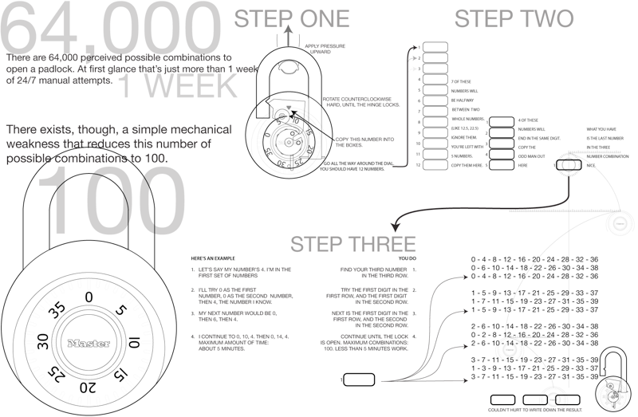

# The Future of CS: Emerging Concepts in CS Education
## Cyber Security Labs

This presentation will look at the following topics in cyber security.

- Social Engineering
- Encryption
- Passwords
- Physical Security

We will discuss how you could teach or demonstrate these topics to students with different knowledge/background using the following lab environments.

- Pen & Paper
- Repl.it with Python Programming
- Kali Linux Virtual Machine
  - Various tools installed on Kali

## Social Engineering
Social engineering is the most common way that people fall victim to a security breach. It basically involves asking a user to give you information you shouldn't have (i.e. their password or login information) in a convincing way.

### Phishing
One of the most basic approaches to social engineering is to send the victim an e-mail, hoping that they click a link or respond with personal information.
- [Phishing Lesson Plan](phishing/example-lesson-plan.pdf)
- [Phishing Presentation](phishing/presentation.pdf)
- [Practice Problems](phishing/practice-problems.pdf)
- [Phishing Game](analyze-the-url-game.pdf)

***Phishing materials created by Kristeen Shabram***

### Email Collection
Part of launching a successful phishing campaign is to get as many e-mail addresses as possible. This may seem like a daunting task but scraping the internet to find addresses is a common and relatively simple technique.

In **repl.it** we are going to run the Email Extractor program. The only thing we need to do is change the ***.replit*** file to run our program by default.
```
language = "python3"
run = "python email/EmailExtractor.py"
```
The first time we run this, it will take a bit of time because Repl.it has to download the Beautiful Soup package which allows us to scrape a website.
At first, I have the extractor pointed at the IS&T faculty page for UNO. I also have the e-mails being stored to a file called ***emails.txt***. This can be changed in the code or by using the prompts when the program is run.

### Social Engineer Toolkit
Using our Kali Linux virtual machine, we will use a tool called the Social Engineer Toolkit (SEToolkit). This has many tools that we can use to try and trick someone into giving us their login credentials.
[Social Engineer Toolkit GitHub Page](https://github.com/trustedsec/social-engineer-toolkit)

## Encryption
The purpose of encryption is to hide important messages or files so that if they are intercepted by someone, they cannot be easily read unless you have the key or knowledge to decode.

### Caesar Cipher
The Caesar Cipher is one of the oldest, and most well-known types of encryption cipher. To encrypt a message, every letter is moved a fixed number of places up the alphabet. For example, if the key were 3, then every letter would be shifted by 3 places A -> D, B -> F, and so on.

[Paper Cipher Wheel](caesar/Papercraft_Caesar_Wheel.pdf)

#### Python Caesar Cipher
To use python with the Caesar Cipher, open the repl.it workspace and change the .replit file to the following:
```
language = "python3"
run = "python caesar/CaesarCipher.py"
```
You will have the ability to encrypt or decrypt.

### Enigma Cipher
The Enigma was a cipher device used by the Germans during the second world war. The device itself was fairly simple but it achieved security through the incredible number of possible starting positions there were. **158,962,555,217,826,360,000** to be exact.
[Pringles Can Enigma](enigma/pringlesenigma3a4.pdf)

#### Python Enigma
For the Python Enigma, we need to change the .replit file again to run the program.
```
language = "python3"
run = "python enigma/Enigma.py"
```

There are a few settings that can be modified. In the **Enigma.py** file:
```
import Rotor1 as LEFT
import Rotor2 as MIDDLE
import Rotor3 as RIGHT
import ReflectorA as RF
```
This will determine which rotor is in the left, middle, and right positions as well as which reflector will be used. You can make more reflectors by copying an existing rotor file and modifying the alphabet and turnover point. The historical data for the enigma rotors can be found on [Wikipedia - Enigma Rotors](https://en.wikipedia.org/wiki/Enigma_rotor_details).

You can also modify the starting positions of each of the rotors with the following code in **Enigma.py**
```
def main():
    setStart("A", "B", "C")
```
Where the letters for the left, middle, and right rotors can be set to an initial value.

### Steganography
Steganography is the art of hiding a message within another medium. In our example we will be hiding a text file in an image file. We can do this by modifying the least important or least significant bit (LSB) of the red, green, blue (RGB) pixel data. This means a message can be hidden in a file without making the file any larger AND the image will be visually identical.

Steganography in python:
```
language = "python3"
run = "python steg/SteganographyApp.py"
```

Steganography Application:
We will be using [Steghide](http://steghide.sourceforge.net/) in our Kali Linux environment. These are our hidden images.
- [Dock.jpg](steg/embedded_images/Dock.jpg) - Passphrase is **s3cr3tw0rd**
- [Waterfall.jpg](steg/embedded_images/Waterfall.jpg)
- [Zoo.jpg](steg/embedded_images/Zoo.jpg)

## Passwords
Passwords are our entry point to our banking, email, wifi, and other important information. Passwords need to be both complicated, and easy to remember. They are one of the biggest weak points in computer security.

### How Secure is my Password
[https://howsecureismypassword.net/](https://howsecureismypassword.net/)

### Python Password Cracker
The python password cracker will try to break into one of the files. Each file has different criteria but this will give an example of how a "brute force" attack could be used against someone's password.
```
language = "python3"
run = "python passwords/PasswordCracker.py"
```
To decide which file you will be attacking, you will change the following bits in the code:
```
#SETUP
fileName = "LockedFile1"
letters = "abcdefghijklmnopqrstuvwxyz"
passLength = 4 #How many characters is the password?
viewAll = True #True or False, select False for maximum speed.
```

### Wifi Password Cracker
Using Kali Linux and a tool called [Aircrack-ng](https://www.aircrack-ng.org/), we will show how simple it is to break the password of a protected wifi network.

We are also using a list of commonly known passwords, leaked from the RockYou hack. The full list of passwords can be found here: [https://github.com/brannondorsey/naive-hashcat/releases/download/data/rockyou.txt](https://github.com/brannondorsey/naive-hashcat/releases/download/data/rockyou.txt) - **Warning. It is a 133 MB file.**

## Physical Security
Physical security is an area of computer security focused on the access to computers, network, and other materials by people physically entering the site. There are many techniques used to break into a building but the main take-away is that if a skilled hacker has physical access to your network, it is very difficult to prevent them from accessing the digital files.

### Masterlocks
Masterlock combination locks are a great analogy for many things in cyber security.
#### Masterlock Rules
- 40 possible digits in each of 3 spots
  - 64,000 possible combos
- All even or all odd
  - 40 * 20 * 20 = 16,000 possibilities
- First number = last number % 4
  - 40 * 20 * 10 = 8000 possibilities
- Middle number = last number % 4 + 2
  - 40 * 10 * 10 = 4000 possibilities

If last number is known: 10 * 10 * 1 = 100 possible combos
First and last cannot be the same: 90 possible combos



### Python Combo Breaker
Once you know the final digit in a masterlock, there are 90 possible combinations. To enumerate these combos, I wrote a python file.

```
language = "python3"
run = "python locks/ComboBreaker.py"
```
